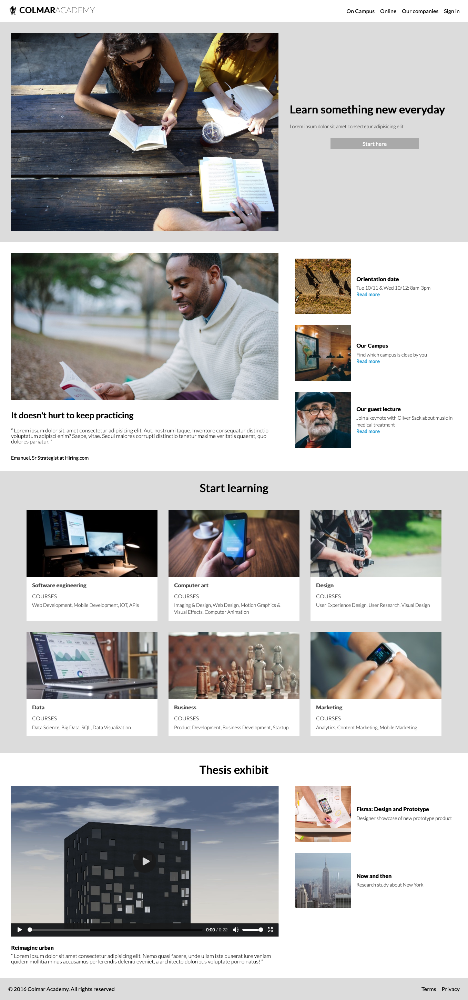

# CodeCademy Project: Colmar Academy

This is my solution to the Colmar Academy challenge in CodeCademy's Build a Website with HTML, CSS and Github Pages Course

## Table of contents

- [Overview](#overview)
  - [The challenge](#the-challenge)
  - [Screenshot](#screenshot)
  - [Links](#links)
- [My process](#my-process)
  - [What I learned](#what-i-learned)
  - [Continued development](#continued-development)
  - [Useful resources](#useful-resources)

## Overview

### The challenge

"Project Goals

You are tasked with designing and creating the landing page for a new school. You will help them by making informed design decisions about color and typography using the skills you learned last week. You will then implement your design.

For this project we will provide you with wireframes. A wireframe is a document which contains the positioning of the elements on a page without specifying any other design information. This allows designers and developers to focus on the flow of a site without getting distracted with design decisions such as color and typography. These aspects of the design are important, but when they are introduced too early, they can detract from other important decisions."

-CodeCademy

### Screenshot

Desktop:

Mobile:

### Links

- Live Site URL: [Colmar Academy](https://andyferrie.github.io/Colmar-Academy/)

## My process

### What I learned

This was my first time creating a site from scratch, writing all the HTML and CSS and working from a wireframe. I initially decided to try and make the site using a grid but ran into some difficulties and settled on using flex instead. I stayed quite close to the wireframe in terms of colour scheme as I liked how it looked but experimented with different hover states and responsiveness. 

I still need to set a media query with larger fonts for high resolution screens as I built the site on my laptop and didnt realise until viewing it on my desktop that it doesnt look too good on a high res screen.

### Continued development

I need to learn more about using grid as when I tried I ran into some difficulties. 

### Useful resources

- [Vertical Align an Image Inside an Anchor with CSS](https://stackoverflow.com/questions/20700475/vertical-align-image-inside-an-anchor-with-css) - This helped me align the site logo.
- [Hover.css](https://ianlunn.github.io/Hover/) - A great resource with some interesting hover effects.